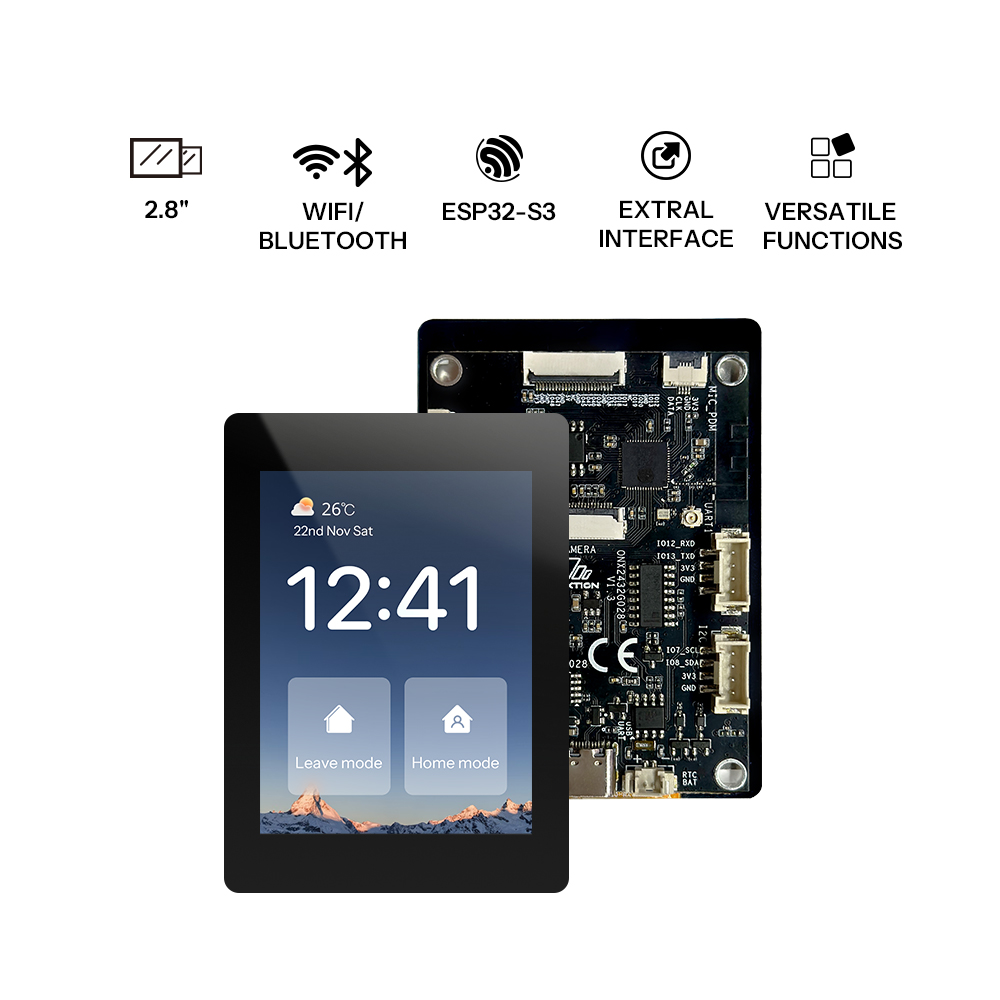
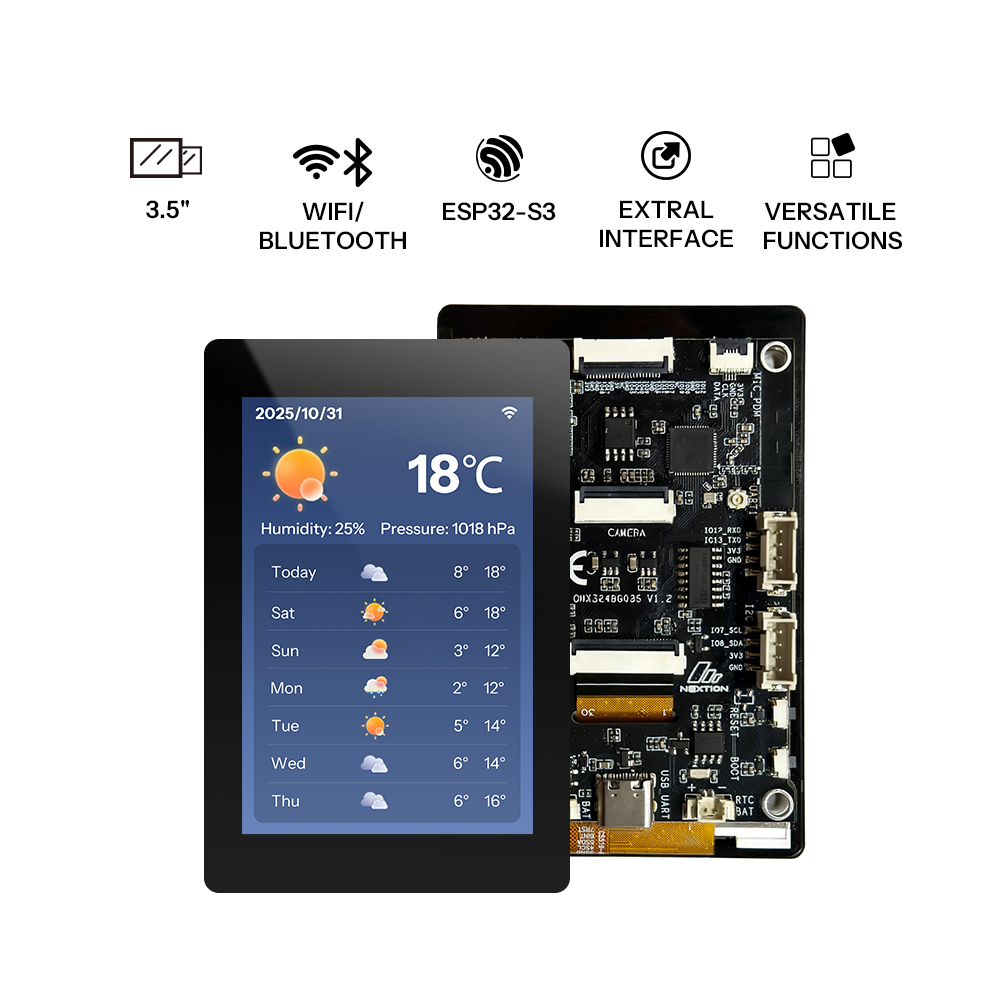

# OpenNextion XiaoZhi AI Chatbot

([English](README.md) | [中文](README_zh.md) | [日本語](README_ja.md))

Turn a supported OpenNextion ESP32-S3 touchscreen into a XiaoZhi AI voice assistant. Flash the firmware for your display, connect it to Wi-Fi, and start a conversation by touching the screen or pressing the BOOT button.

<!-- MEDIA TODO — Hero image/video. Suggested path: docs/images/opennextion-xiaozhi-hero.jpg
     Show a powered-on OpenNextion panel in its finished desktop enclosure. Recommended width: 820 px. -->

  
  

> This is an OpenNextion hardware port of [xiaozhi-esp32](https://github.com/78/xiaozhi-esp32), intended for the two panels below.

## Supported hardware

| OpenNextion model | Display | Orientation | Firmware board name | Status |
| --- | --- | --- | --- | --- |
| [ONX2432G028][onx2432g028] | 2.8-inch capacitive touch, 240 × 320 | Portrait | <code>OpenNextion-ONX2432G028</code> | Supported |
| [ONX3248G035][onx3248g035] | 3.5-inch capacitive touch, 320 × 480 | Portrait | <code>OpenNextion-ONX3248G035</code> | Supported |

**Always use firmware made for the exact model printed on your panel. Do not flash ONX2432G028 firmware to ONX3248G035, or the other way around.**

The port supports the display, capacitive touch, dual microphones, speaker, and Wi-Fi. It requires a 2.4 GHz Wi-Fi network.

## Before you start

- One supported OpenNextion panel from the table above.
- A USB cable that carries data, not a charge-only cable.
- A Windows, macOS, or Linux computer.
- A 2.4 GHz Wi-Fi network. ESP32-S3 does not join a 5 GHz-only network.
- A [xiaozhi.me](https://xiaozhi.me) account if you use the default XiaoZhi service.

## Quick start

### 1. Get the matching firmware

Download the newest firmware from the project's [GitHub Releases](https://github.com/OpenNextion/OpenNextion-Example-xiaozhi-esp32/releases) page. The current <code>v2.2.6</code> initial-flash images are:

| Your panel | Download |
| --- | --- |
| ONX2432G028 | [<code>xiaozhi_V2.2.6_merged_ONX2432G028_en_Jarvis.bin</code>](https://github.com/OpenNextion/OpenNextion-Example-xiaozhi-esp32/releases/download/v2.2.6/xiaozhi_V2.2.6_merged_ONX2432G028_en_Jarvis.bin) |
| ONX3248G035 | [<code>xiaozhi_V2.2.6_merged_ONX3248G035_en_Jarvis.bin</code>](https://github.com/OpenNextion/OpenNextion-Example-xiaozhi-esp32/releases/download/v2.2.6/xiaozhi_V2.2.6_merged_ONX3248G035_en_Jarvis.bin) |

Choose the file whose <code>ONX...</code> model code matches your panel. Do not use a firmware package made for another XiaoZhi board.

### 2. Flash the panel

<!-- MEDIA TODO — Flashing image. Suggested path: docs/images/opennextion-xiaozhi-flashing.jpg
     Show the panel connected by USB and the flashing tool with the matching model selected. Recommended width: 620 px. -->

1. Connect the panel to the computer with a data-capable USB cable.
2. Use the [beginner flashing guide][flashing-guide] to write the matching <code>.bin</code> file at address <code>0x0</code>.
3. Wait for flashing to finish, then allow the panel to restart.

If no serial device appears, try another USB cable or USB port first. Some cables provide power only. If the flashing tool cannot connect, enter download mode with the panel's BOOT and Reset controls, then try again.

### 3. Connect to Wi-Fi

<!-- MEDIA TODO — Wi-Fi setup image. Suggested path: docs/images/opennextion-xiaozhi-wifi-setup.jpg
     Show the Xiaozhi-xxxx hotspot and/or the http://192.168.4.1 setup page. Recommended width: 620 px. -->

On first boot, or when the saved Wi-Fi connection cannot be used, the device starts a setup hotspot named <code>Xiaozhi-xxxx</code>.

1. On a phone or computer, connect to the <code>Xiaozhi-xxxx</code> Wi-Fi network.
2. Open <http://192.168.4.1> if the setup page does not open automatically.
3. Select your 2.4 GHz home Wi-Fi network and enter its password.
4. Save the settings and wait for the device to join Wi-Fi and continue startup.

The configuration hotspot is open. Configure the device in a trusted location and leave setup mode when finished.

### 4. Activate and start talking

<!-- MEDIA TODO — Activation/use image. Suggested path: docs/images/opennextion-xiaozhi-activation.jpg
     Show the activation screen or a user starting a conversation by touch. Recommended width: 620 px. -->

The default firmware connects to [xiaozhi.me](https://xiaozhi.me). Follow the on-screen activation prompt, then sign in to the XiaoZhi console to manage the device and model settings.

To talk, either tap the touchscreen once or briefly press the **BOOT** button. Use the same action again to stop the current conversation.

## Everyday use

| What you want to do | How |
| --- | --- |
| Start or stop a conversation | Tap the touchscreen, or briefly press **BOOT**. |
| Change AI-service settings | Sign in to the [xiaozhi.me](https://xiaozhi.me) console after the device is activated. |
| Connect to a different Wi-Fi network | Restart the device and enter Wi-Fi configuration during startup with the **BOOT** button, then complete the hotspot setup. |
| Recover from wrong or broken firmware | Reflash a complete USB firmware package for the exact panel model. |
| Update firmware | Use only an update package explicitly made for your panel model and follow its release notes. |

## XiaoZhi service and model configuration

After the device is activated on the default service, sign in to the [xiaozhi.me](https://xiaozhi.me) console to manage the device and its available AI-model settings. The service selection, model availability, and account options are managed there rather than in the panel firmware.

For a self-hosted service or an alternative backend, use a server compatible with the XiaoZhi protocol and configure it according to that server's documentation. Useful starting points are:

- [xiaozhi-esp32-server](https://github.com/xinnan-tech/xiaozhi-esp32-server) (Python)
- [xiaozhi-esp32-server-java](https://github.com/joey-zhou/xiaozhi-esp32-server-java) (Java)
- [xiaozhi-server-go](https://github.com/AnimeAIChat/xiaozhi-server-go) (Go)

## Troubleshooting

### The computer cannot find the panel

Use a USB cable that supports data and try another USB port. If the board still does not appear, install the USB serial driver required by your operating system.

### Flashing cannot connect

Disconnect and reconnect USB, then retry. If necessary, use the panel's BOOT and Reset controls to enter download mode before starting the flash again.

### The device cannot join Wi-Fi

Confirm that the selected network provides 2.4 GHz Wi-Fi and that its password is correct. Re-enter setup by pressing **BOOT** during startup, connect to the <code>Xiaozhi-xxxx</code> hotspot, and configure the network again.

### The screen is incorrect or touch does not work

The wrong firmware is probably installed. Reflash a complete USB firmware package for the exact panel model. The two OpenNextion firmware targets are not interchangeable.

## Enclosures and images

<!-- MEDIA TODO — Add final installation photos and public 3D-model links.
     Suggested paths:
       docs/images/onx2432g028-xiaozhi-enclosure.jpg
       docs/images/onx3248g035-xiaozhi-enclosure.jpg
     Show one angled photo per model with the panel fitted in its printed enclosure. -->

Desktop enclosure photos and downloadable 3D-print files will be added later.

| Model | 3D-printable enclosure |
| --- | --- |
| ONX2432G028 | Link to be added |
| ONX3248G035 | Link to be added |

## For developers

Most users do not need a development environment. Build from source only when you need to modify the firmware or release firmware is not yet available.

1. Install the ESP-IDF extension for VS Code or Cursor with ESP-IDF 5.4 or later.
2. In the project directory, select the ESP32-S3 target and open configuration:

~~~sh
idf.py set-target esp32s3
idf.py menuconfig
~~~

3. In <code>menuconfig</code>, open <strong>Board Type</strong>, then select exactly one matching entry:

   - <strong>OpenNextion ONX2432G028</strong> for the 2.8-inch panel.
   - <strong>OpenNextion ONX3248G035</strong> for the 3.5-inch panel.

   Save the configuration and exit <code>menuconfig</code>. Do not select another board with a similar screen size.

4. Build and flash it:

~~~sh
idf.py build
idf.py flash monitor
~~~

Board files are in [main/boards/OpenNextion_ONX2432G028](main/boards/OpenNextion_ONX2432G028) and [main/boards/OpenNextion_ONX3248G035](main/boards/OpenNextion_ONX3248G035). For custom hardware and protocol work, see the [custom board guide](docs/custom-board.md), [MCP usage guide](docs/mcp-usage.md), and [WebSocket protocol](docs/websocket.md).

### Developer documentation

- [Custom board guide](docs/custom-board.md) — add a board or modify hardware support.
- [MCP usage guide](docs/mcp-usage.md) and [MCP protocol](docs/mcp-protocol.md) — expose device features to AI services.
- [MQTT + UDP protocol](docs/mqtt-udp.md) and [WebSocket protocol](docs/websocket.md) — integrate a custom backend.
- [BluFi provisioning](docs/blufi.md) — use Bluetooth-based Wi-Fi provisioning instead of the default hotspot flow.

## Credits and license

This project is based on [xiaozhi-esp32](https://github.com/78/xiaozhi-esp32) and is released under the [MIT License](LICENSE). Third-party components may have their own license notices.

Flashing third-party firmware carries a risk of device damage or data loss. Confirm that the firmware matches your panel before installation.

[flashing-guide]: https://ccnphfhqs21z.feishu.cn/wiki/Zpz4wXBtdimBrLk25WdcXzxcnNS
[onx2432g028]: https://nextion.tech/wiki/onx2432g028/
[onx3248g035]: https://nextion.tech/wiki/onx3248g035/
